# Assignment 2: Markov Decision Processes


## Homework Instructions
All your answers should be written in this notebook.  You shouldn't need to write or modify any other files.
Look for four instances of "YOUR CODE HERE"--those are the only parts of the code you need to write. To grade your homework, we will check whether the printouts immediately following your code match up with the results we got. The portions used for grading are highlighted in yellow. (However, note that the yellow highlighting does not show up when github renders this file.)

To submit your homework, send an email to <berkeleydeeprlcourse@gmail.com> with the subject line "Deep RL Assignment 2" and two attachments:
1. This `ipynb` file
2. A pdf version of this file (To make the pdf, do `File - Print Preview`)

The homework is due Febrary 22nd, 11:59 pm.

--------------------------

## Introduction

This assignment will review the two classic methods for solving Markov Decision Processes (MDPs) with finite state and action spaces.
We will implement value iteration (VI) and policy iteration (PI) for a finite MDP, both of which find the optimal policy in a finite number of iterations.

The experiments here will use the Frozen Lake environment, a simple gridworld MDP that is taken from `gym` and slightly modified for this assignment. In this MDP, the agent must navigate from the start state to the goal state on a 4x4 grid, with stochastic transitions.


```python
from frozen_lake import FrozenLakeEnv
env = FrozenLakeEnv()
print(env.__doc__)
```

    
        Winter is here. You and your friends were tossing around a frisbee at the park
        when you made a wild throw that left the frisbee out in the middle of the lake.
        The water is mostly frozen, but there are a few holes where the ice has melted.
        If you step into one of those holes, you'll fall into the freezing water.
        At this time, there's an international frisbee shortage, so it's absolutely imperative that
        you navigate across the lake and retrieve the disc.
        However, the ice is slippery, so you won't always move in the direction you intend.
        The surface is described using a grid like the following
    
            SFFF
            FHFH
            FFFH
            HFFG
    
        S : starting point, safe
        F : frozen surface, safe
        H : hole, fall to your doom
        G : goal, where the frisbee is located
    
        The episode ends when you reach the goal or fall in a hole.
        You receive a reward of 1 if you reach the goal, and zero otherwise.
    
        


Let's look at what a random episode looks like.


```python
# Some basic imports and setup
import numpy as np, numpy.random as nr, gym
np.set_printoptions(precision=3)
def begin_grading(): print("\x1b[43m")
def end_grading(): print("\x1b[0m")

# Seed RNGs so you get the same printouts as me
env.seed(0); from gym.spaces import prng; prng.seed(10)
# Generate the episode
env.reset()
for t in range(100):
    env.render()
    a = env.action_space.sample()
    ob, rew, done, _ = env.step(a)
    if done:
        break
assert done
env.render();
```

    
    SFFF
    FHFH
    FFFH
    HFFG
      (Down)
    SFFF
    FHFH
    FFFH
    HFFG
      (Down)
    SFFF
    FHFH
    FFFH
    HFFG


In the episode above, the agent falls into a hole after two timesteps. Also note the stochasticity--on the first step, the DOWN action is selected, but the agent moves to the right.

We extract the relevant information from the gym Env into the MDP class below.
The `env` object won't be used any further, we'll just use the `mdp` object.


```python
class MDP(object):
    def __init__(self, P, nS, nA, desc=None):
        self.P = P # state transition and reward probabilities, explained below
        self.nS = nS # number of states
        self.nA = nA # number of actions
        self.desc = desc # 2D array specifying what each grid cell means (used for plotting)
mdp = MDP( {s : {a : [tup[:3] for tup in tups] for (a, tups) in a2d.items()} for (s, a2d) in env.P.items()}, env.nS, env.nA, env.desc)


print("mdp.P is a two-level dict where the first key is the state and the second key is the action.")
print("The 2D grid cells are associated with indices [0, 1, 2, ..., 15] from left to right and top to down, as in")
print(np.arange(16).reshape(4,4))
print("mdp.P[state][action] is a list of tuples (probability, nextstate, reward).\n")
print("For example, state 0 is the initial state, and the transition information for s=0, a=0 is \nP[0][0] =", mdp.P[0][0], "\n")
print("As another example, state 5 corresponds to a hole in the ice, which transitions to itself with probability 1 and reward 0.")
print("P[5][0] =", mdp.P[5][0], '\n')
```

    mdp.P is a two-level dict where the first key is the state and the second key is the action.
    The 2D grid cells are associated with indices [0, 1, 2, ..., 15] from left to right and top to down, as in
    [[ 0  1  2  3]
     [ 4  5  6  7]
     [ 8  9 10 11]
     [12 13 14 15]]
    mdp.P[state][action] is a list of tuples (probability, nextstate, reward).
    
    For example, state 0 is the initial state, and the transition information for s=0, a=0 is 
    P[0][0] = [(0.1, 0, 0.0), (0.8, 0, 0.0), (0.1, 4, 0.0)] 
    
    As another example, state 5 corresponds to a hole in the ice, which transitions to itself with probability 1 and reward 0.
    P[5][0] = [(1.0, 5, 0)] 
    


## Part 1: Value Iteration

### Problem 1: implement value iteration
In this problem, you'll implement value iteration, which has the following pseudocode:

---
Initialize $V^{(0)}(s)=0$, for all $s$

For $i=0, 1, 2, \dots$
- $V^{(i+1)}(s) = \max_a \sum_{s'} P(s,a,s') [ R(s,a,s') + \gamma V^{(i)}(s')]$, for all $s$

---

We additionally define the sequence of greedy policies $\pi^{(0)}, \pi^{(1)}, \dots, \pi^{(n-1)}$, where
$$\pi^{(i)}(s) = \arg \max_a \sum_{s'} P(s,a,s') [ R(s,a,s') + \gamma V^{(i)}(s')]$$

Your code will return two lists: $[V^{(0)}, V^{(1)}, \dots, V^{(n)}]$ and $[\pi^{(0)}, \pi^{(1)}, \dots, \pi^{(n-1)}]$

To ensure that you get the same policies as the reference solution, choose the lower-index action to break ties in $\arg \max_a$. This is done automatically by np.argmax. This will only affect the "# chg actions" printout below--it won't affect the values computed.

<div class="alert alert-warning">
Warning: make a copy of your value function each iteration and use that copy for the update--don't update your value function in place. 
Updating in-place is also a valid algorithm, sometimes called Gauss-Seidel value iteration or asynchronous value iteration, but it will cause you to get different results than me.
</div>


```python
def value_iteration(mdp, gamma, nIt):
    """
    Inputs:
        mdp: MDP
        gamma: discount factor
        nIt: number of iterations, corresponding to n above
    Outputs:
        (value_functions, policies)
        
    len(value_functions) == nIt+1 and len(policies) == n
    """
    print("Iteration | max|V-Vprev| | # chg actions | V[0]")
    print("----------+--------------+---------------+---------")
    Vs = [np.zeros(mdp.nS)] # list of value functions contains the initial value function, which is zero
    pis = []
    for it in range(nIt):
        Vprev = Vs[-1]
        # YOUR CODE HERE
        # Your code should define variables V: the bellman backup applied to Vprev
        # and pi: the greedy policy applied to Vprev
        max_diff = np.abs(V - Vprev).max()
        nChgActions="N/A" if oldpi is None else (pi != oldpi).sum()
        print("%4i      | %6.5f      | %4s          | %5.3f"%(it, max_diff, nChgActions, V[0]))
        Vs.append(V)
        pis.append(pi)
    return Vs, pis

GAMMA=0.95 # we'll be using this same value in subsequent problems
begin_grading()
Vs_VI, pis_VI = value_iteration(mdp, gamma=GAMMA, nIt=20)
end_grading()

```

    
    Iteration | max|V-Vprev| | # chg actions | V[0]
    ----------+--------------+---------------+---------
       0      | 0.80000      |  N/A          | 0.000
       1      | 0.60800      |    2          | 0.000
       2      | 0.51984      |    2          | 0.000
       3      | 0.39508      |    2          | 0.000
       4      | 0.30026      |    2          | 0.000
       5      | 0.25355      |    1          | 0.254
       6      | 0.10478      |    0          | 0.345
       7      | 0.09657      |    0          | 0.442
       8      | 0.03656      |    0          | 0.478
       9      | 0.02772      |    0          | 0.506
      10      | 0.01111      |    0          | 0.517
      11      | 0.00735      |    0          | 0.524
      12      | 0.00310      |    0          | 0.527
      13      | 0.00190      |    0          | 0.529
      14      | 0.00083      |    0          | 0.530
      15      | 0.00049      |    0          | 0.531
      16      | 0.00022      |    0          | 0.531
      17      | 0.00013      |    0          | 0.531
      18      | 0.00006      |    0          | 0.531
      19      | 0.00003      |    0          | 0.531
    


Below, we've illustrated the progress of value iteration. Your optimal actions are shown by arrows.
At the bottom, the value of the different states are plotted.


```python
import matplotlib.pyplot as plt
%matplotlib inline
for (V, pi) in zip(Vs_VI[:10], pis_VI[:10]):
    plt.figure(figsize=(3,3))
    plt.imshow(V.reshape(4,4), cmap='gray', interpolation='none', clim=(0,1))
    ax = plt.gca()
    ax.set_xticks(np.arange(4)-.5)
    ax.set_yticks(np.arange(4)-.5)
    ax.set_xticklabels([])
    ax.set_yticklabels([])
    Y, X = np.mgrid[0:4, 0:4]
    a2uv = {0: (-1, 0), 1:(0, -1), 2:(1,0), 3:(-1, 0)}
    Pi = pi.reshape(4,4)
    for y in range(4):
        for x in range(4):
            a = Pi[y, x]
            u, v = a2uv[a]
            plt.arrow(x, y,u*.3, -v*.3, color='m', head_width=0.1, head_length=0.1) 
            plt.text(x, y, str(env.desc[y,x].item().decode()),
                     color='g', size=12,  verticalalignment='center',
                     horizontalalignment='center', fontweight='bold')
    plt.grid(color='b', lw=2, ls='-')
plt.figure()
plt.plot(Vs_VI)
plt.title("Values of different states");
```


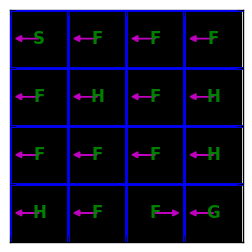


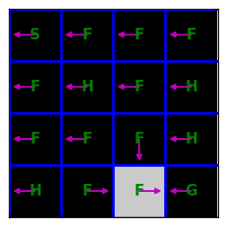


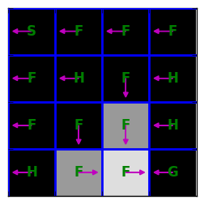


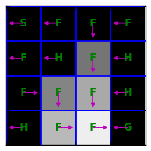


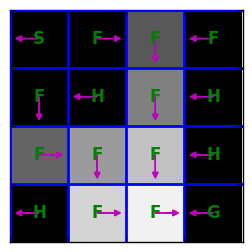


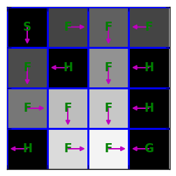


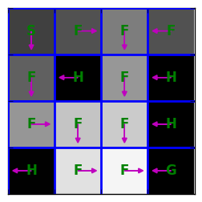


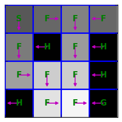


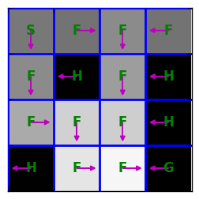


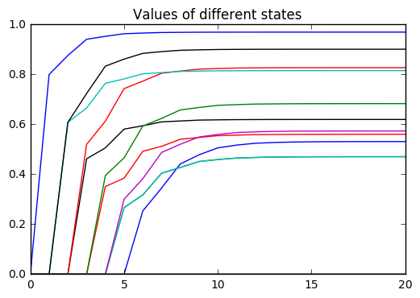


## Problem 2: construct an MDP where value iteration takes a long time to converge

When we ran value iteration on the frozen lake problem, the last iteration where an action changed was iteration 6--i.e., value iteration computed the optimal policy at iteration 6.
Are there any guarantees regarding how many iterations it'll take value iteration to compute the optimal policy?
There are no such guarantees without additional assumptions--we can construct the MDP in such a way that the greedy policy will change after arbitrarily many iterations.

Your task: define an MDP with at most 3 states and 2 actions, such that when you run value iteration, the optimal action changes at iteration >= 50. Use discount=0.95. (However, note that the discount doesn't matter here--you can construct an appropriate MDP with any discount.)


```python
chg_iter = 50
# YOUR CODE HERE
# Your code will need to define an MDP (mymdp)
# like the frozen lake MDP defined above
begin_grading()
Vs, pis = value_iteration(mymdp, gamma=GAMMA, nIt=chg_iter+1)
end_grading()
```

    
    Iteration | max|V-Vprev| | # chg actions | V[0]
    ----------+--------------+---------------+---------
       0      | 1.00000      |  N/A          | 1.000
       1      | 0.05441      |    0          | 1.000
       2      | 0.05169      |    0          | 1.000
       3      | 0.04910      |    0          | 1.000
       4      | 0.04665      |    0          | 1.000
       5      | 0.04431      |    0          | 1.000
       6      | 0.04210      |    0          | 1.000
       7      | 0.03999      |    0          | 1.000
       8      | 0.03799      |    0          | 1.000
       9      | 0.03609      |    0          | 1.000
      10      | 0.03429      |    0          | 1.000
      11      | 0.03258      |    0          | 1.000
      12      | 0.03095      |    0          | 1.000
      13      | 0.02940      |    0          | 1.000
      14      | 0.02793      |    0          | 1.000
      15      | 0.02653      |    0          | 1.000
      16      | 0.02521      |    0          | 1.000
      17      | 0.02395      |    0          | 1.000
      18      | 0.02275      |    0          | 1.000
      19      | 0.02161      |    0          | 1.000
      20      | 0.02053      |    0          | 1.000
      21      | 0.01950      |    0          | 1.000
      22      | 0.01853      |    0          | 1.000
      23      | 0.01760      |    0          | 1.000
      24      | 0.01672      |    0          | 1.000
      25      | 0.01589      |    0          | 1.000
      26      | 0.01509      |    0          | 1.000
      27      | 0.01434      |    0          | 1.000
      28      | 0.01362      |    0          | 1.000
      29      | 0.01294      |    0          | 1.000
      30      | 0.01229      |    0          | 1.000
      31      | 0.01168      |    0          | 1.000
      32      | 0.01109      |    0          | 1.000
      33      | 0.01054      |    0          | 1.000
      34      | 0.01001      |    0          | 1.000
      35      | 0.00951      |    0          | 1.000
      36      | 0.00904      |    0          | 1.000
      37      | 0.00858      |    0          | 1.000
      38      | 0.00816      |    0          | 1.000
      39      | 0.00775      |    0          | 1.000
      40      | 0.00736      |    0          | 1.000
      41      | 0.00699      |    0          | 1.000
      42      | 0.00664      |    0          | 1.000
      43      | 0.00631      |    0          | 1.000
      44      | 0.00599      |    0          | 1.000
      45      | 0.00569      |    0          | 1.000
      46      | 0.00541      |    0          | 1.000
      47      | 0.00514      |    0          | 1.000
      48      | 0.00488      |    0          | 1.000
      49      | 0.00464      |    0          | 1.000
      50      | 0.00441      |    1          | 1.004
    


## Problem 3: Policy Iteration

The next task is to implement exact policy iteration (PI), which has the following pseudocode:

---
Initialize $\pi_0$

For $n=0, 1, 2, \dots$
- Compute the state-value function $V^{\pi_{n}}$
- Using $V^{\pi_{n}}$, compute the state-action-value function $Q^{\pi_{n}}$
- Compute new policy $\pi_{n+1}(s) = \operatorname*{argmax}_a Q^{\pi_{n}}(s,a)$
---

Below, you'll implement the first and second steps of the loop.

### Problem 3a: state value function

You'll write a function called `compute_vpi` that computes the state-value function $V^{\pi}$ for an arbitrary policy $\pi$.
Recall that $V^{\pi}$ satisfies the following linear equation:
$$V^{\pi}(s) = \sum_{s'} P(s,\pi(s),s')[ R(s,\pi(s),s') + \gamma V^{\pi}(s')]$$
You'll have to solve a linear system in your code.


```python
def compute_vpi(pi, mdp, gamma):
    # YOUR CODE HERE
    return V
```

Now let's compute the value of an arbitrarily-chosen policy. 


```python
begin_grading()
print(compute_vpi(np.ones(16), mdp, gamma=GAMMA))
end_grading()
```

    
    [  1.638e-02   2.357e-02   2.317e-01   2.433e-02   1.656e-02  -0.000e+00
       2.989e-01   0.000e+00   1.972e-02   1.879e-01   3.934e-01   0.000e+00
      -3.581e-17   1.956e-01   4.941e-01   0.000e+00]
    


As a sanity check, if we run `compute_vpi` on the solution from our previous value iteration run, we should get approximately (but not exactly) the same values produced by value iteration.


```python
Vpi=compute_vpi(pis_VI[15], mdp, gamma=GAMMA)
V_vi = Vs_VI[15]
print("From compute_vpi", Vpi)
print("From value iteration", V_vi)
print("Difference", Vpi - V_vi)
```

    From compute_vpi [ 0.531  0.471  0.56   0.471  0.574 -0.     0.62   0.     0.683  0.827
      0.815  0.     0.     0.901  0.97   0.   ]
    From value iteration [ 0.53   0.47   0.56   0.47   0.573  0.     0.62   0.     0.683  0.827
      0.815  0.     0.     0.901  0.97   0.   ]
    Difference [  9.580e-04   3.839e-04   2.254e-04   3.839e-04   4.495e-04  -0.000e+00
       4.522e-05   0.000e+00   2.612e-04   1.071e-04   3.272e-05   0.000e+00
       0.000e+00   3.977e-05   7.051e-06   0.000e+00]


### Problem 3b: state-action value function

Next, you'll write a function to compute the state-action value function $Q^{\pi}$, defined as follows

$$Q^{\pi}(s, a) = \sum_{s'} P(s,a,s')[ R(s,a,s') + \gamma V^{\pi}(s')]$$


```python
def compute_qpi(vpi, pi, mdp,  gamma):
    # YOUR CODE HERE
    return Qpi

begin_grading()
Qpi = compute_qpi(Vpi, pis_VI[-1], mdp, gamma=0.95)
end_grading()
print("Qpi:\n", Qpi)
```

    
    
    Qpi:
     [[ 0.509  0.531  0.463  0.499]
     [ 0.448  0.104  0.471  0.461]
     [ 0.47   0.56   0.47   0.515]
     [ 0.471  0.098  0.402  0.456]
     [ 0.551  0.574  0.115  0.458]
     [ 0.     0.     0.     0.   ]
     [ 0.131  0.62   0.131  0.426]
     [ 0.     0.     0.     0.   ]
     [ 0.574  0.143  0.683  0.579]
     [ 0.605  0.827  0.705  0.142]
     [ 0.78   0.815  0.151  0.55 ]
     [ 0.     0.     0.     0.   ]
     [ 0.     0.     0.     0.   ]
     [ 0.164  0.777  0.901  0.721]
     [ 0.854  0.922  0.97   0.805]
     [ 0.     0.     0.     0.   ]]


Now we're ready to run policy iteration!


```python
def policy_iteration(mdp, gamma, nIt):
    Vs = []
    pis = []
    pi_prev = np.zeros(mdp.nS,dtype='int')
    pis.append(pi_prev)
    print("Iteration | # chg actions | V[0]")
    print("----------+---------------+---------")
    for it in range(nIt):        
        vpi = compute_vpi(pi_prev, mdp, gamma)
        qpi = compute_qpi(vpi, pi_prev, mdp, gamma)
        pi = qpi.argmax(axis=1)
        print("%4i      | %6i        | %6.5f"%(it, (pi != pi_prev).sum(), vpi[0]))
        Vs.append(vpi)
        pis.append(pi)
        pi_prev = pi
    return Vs, pis
Vs_PI, pis_PI = policy_iteration(mdp, gamma=0.95, nIt=20)
plt.plot(Vs_PI);
```

    Iteration | # chg actions | V[0]
    ----------+---------------+---------
       0      |      1        | -0.00000
       1      |      9        | 0.00000
       2      |      2        | 0.39785
       3      |      1        | 0.45546
       4      |      0        | 0.53118
       5      |      0        | 0.53118
       6      |      0        | 0.53118
       7      |      0        | 0.53118
       8      |      0        | 0.53118
       9      |      0        | 0.53118
      10      |      0        | 0.53118
      11      |      0        | 0.53118
      12      |      0        | 0.53118
      13      |      0        | 0.53118
      14      |      0        | 0.53118
      15      |      0        | 0.53118
      16      |      0        | 0.53118
      17      |      0        | 0.53118
      18      |      0        | 0.53118
      19      |      0        | 0.53118


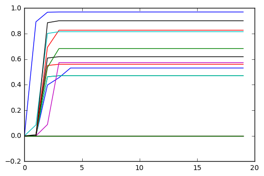


Now we can compare the convergence of value iteration and policy iteration on several states.
For fun, you can try adding modified policy iteration.


```python
for s in range(5):
    plt.figure()
    plt.plot(np.array(Vs_VI)[:,s])
    plt.plot(np.array(Vs_PI)[:,s])
    plt.ylabel("value of state %i"%s)
    plt.xlabel("iteration")
    plt.legend(["value iteration", "policy iteration"], loc='best')
```


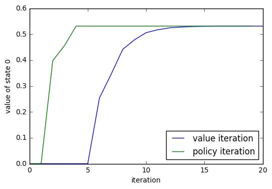


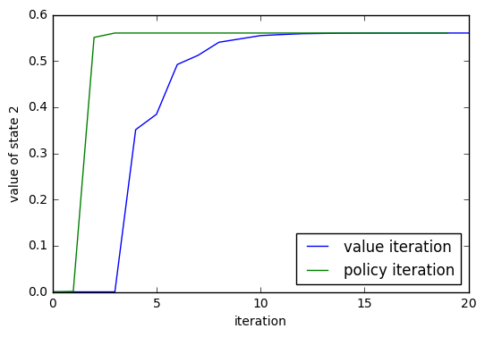


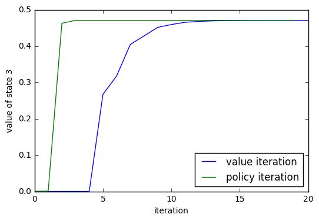


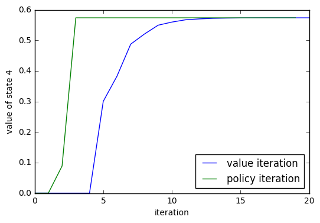

